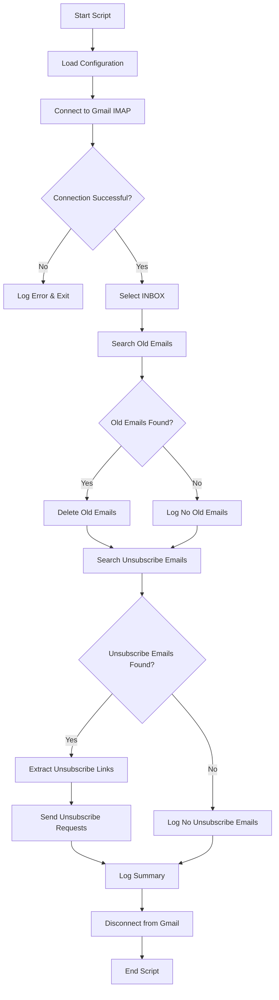

# Design Document

## Overview

The Gmail IMAP Cleaner is a Python script that automates email management tasks by connecting to Gmail via IMAP protocol. The script performs two main functions: deleting emails older than a specified date and automatically unsubscribing from mailing lists by extracting and visiting unsubscribe links. The design emphasizes simplicity, reliability, and comprehensive logging while using only standard Python libraries.

## Architecture

The script follows a procedural architecture with clear separation of concerns:

```
┌─────────────────────────────────────────────────────────────┐
│                    Gmail IMAP Cleaner                       │
├─────────────────────────────────────────────────────────────┤
│  Configuration Layer                                        │
│  - Email credentials                                        │
│  - Date cutoff settings                                     │
│  - IMAP server settings                                     │
├─────────────────────────────────────────────────────────────┤
│  Connection Management                                      │
│  - IMAP SSL connection                                      │
│  - Authentication handling                                  │
│  - Session management                                       │
├─────────────────────────────────────────────────────────────┤
│  Email Processing Engine                                    │
│  ├─ Old Email Deletion Module                              │
│  │  - Date-based email search                              │
│  │  - Email deletion and expunge                           │
│  └─ Unsubscribe Processing Module                          │
│     - Unsubscribe email detection                          │
│     - Link extraction via regex                            │
│     - HTTP request handling                                │
├─────────────────────────────────────────────────────────────┤
│  Logging and Error Handling                                │
│  - Operation logging                                        │
│  - Exception handling                                       │
│  - Summary reporting                                        │
└─────────────────────────────────────────────────────────────┘
```

## Components and Interfaces

### 1. Configuration Component
- **Purpose**: Centralized configuration management
- **Variables**:
  - `EMAIL`: Gmail address
  - `PASSWORD`: Gmail password or app password
  - `CUTOFF_DATE`: Date string in "DD-MMM-YYYY" format
  - `IMAP_SERVER`: Gmail IMAP server (imap.gmail.com)
  - `IMAP_PORT`: SSL port (993)

### 2. IMAP Connection Manager
- **Purpose**: Handle Gmail IMAP connection lifecycle
- **Functions**:
  - `connect_to_gmail()`: Establish SSL connection and authenticate
  - `disconnect_from_gmail()`: Clean connection closure
- **Error Handling**: Network timeouts, authentication failures, SSL errors

### 3. Email Search and Deletion Module
- **Purpose**: Find and delete old emails
- **Functions**:
  - `search_old_emails(cutoff_date)`: Search emails older than cutoff
  - `delete_emails(email_ids)`: Delete specified emails
  - `parse_email_date(date_string)`: Convert email date to datetime object
- **Search Criteria**: `BEFORE` IMAP search with formatted date

### 4. Unsubscribe Processing Module
- **Purpose**: Find unsubscribe emails and process links
- **Functions**:
  - `search_unsubscribe_emails()`: Find emails with "unsubscribe" keyword
  - `extract_unsubscribe_links(email_content)`: Regex-based link extraction
  - `send_unsubscribe_request(url)`: HTTP GET request to unsubscribe
- **Regex Pattern**: `r'https?://[^\s<>"]+unsubscribe[^\s<>"]*'`

### 5. Logging System
- **Purpose**: Comprehensive operation tracking
- **Log Levels**: INFO for operations, ERROR for exceptions
- **Log Format**: Timestamp, operation type, details

## Data Models

### Email Message Structure
```python
EmailMessage = {
    'id': str,           # IMAP message ID
    'subject': str,      # Email subject line
    'from': str,         # Sender address
    'date': datetime,    # Email date
    'content': str       # Email body content
}
```

### Unsubscribe Link Structure
```python
UnsubscribeLink = {
    'url': str,          # Full unsubscribe URL
    'email_id': str,     # Source email ID
    'status': str        # Request status (success/failed)
}
```

### Operation Summary Structure
```python
OperationSummary = {
    'emails_deleted': int,
    'unsubscribe_emails_found': int,
    'unsubscribe_links_processed': int,
    'successful_unsubscribes': int,
    'failed_unsubscribes': int
}
```

## Error Handling

### Connection Errors
- **IMAP Connection Failures**: Retry logic with exponential backoff
- **Authentication Errors**: Clear error messages for credential issues
- **SSL/TLS Errors**: Fallback to different SSL contexts if needed

### Email Processing Errors
- **Invalid Date Formats**: Skip emails with unparseable dates
- **Corrupted Email Content**: Log error and continue processing
- **IMAP Command Failures**: Retry with error logging

### HTTP Request Errors
- **Network Timeouts**: 10-second timeout with retry
- **HTTP Error Responses**: Log status code and continue
- **Invalid URLs**: Skip malformed URLs with logging

### Exception Handling Strategy
```python
try:
    # Operation code
except SpecificException as e:
    log_error(f"Specific error: {e}")
    # Handle specific case
except Exception as e:
    log_error(f"Unexpected error: {e}")
    # General fallback
finally:
    # Cleanup operations
```

## Testing Strategy

### Unit Testing Approach
1. **Configuration Validation**: Test configuration parsing and validation
2. **Date Processing**: Test date parsing and comparison logic
3. **Regex Testing**: Validate unsubscribe link extraction patterns
4. **Error Handling**: Test exception handling for various failure scenarios

### Integration Testing
1. **IMAP Connection**: Test connection establishment and authentication
2. **Email Search**: Validate search criteria and result parsing
3. **HTTP Requests**: Test unsubscribe request handling

### Manual Testing Scenarios
1. **Empty Inbox**: Test behavior with no emails
2. **No Old Emails**: Test when no emails match date criteria
3. **No Unsubscribe Emails**: Test when no unsubscribe emails exist
4. **Network Failures**: Test behavior during network interruptions

### Security Considerations
- **Credential Handling**: Avoid logging sensitive information
- **URL Validation**: Basic validation before making HTTP requests
- **Rate Limiting**: Implement delays between unsubscribe requests
- **SSL Verification**: Ensure proper SSL certificate validation

## Implementation Flow



## Performance Considerations

- **Batch Processing**: Process emails in batches to avoid memory issues
- **Connection Reuse**: Maintain single IMAP connection throughout script execution
- **Request Throttling**: Add delays between unsubscribe requests to avoid rate limiting
- **Memory Management**: Process large email bodies efficiently without loading all into memory

## Configuration Example

```python
# Gmail IMAP Configuration
EMAIL = "your.email@gmail.com"
PASSWORD = "your_app_password_here"
CUTOFF_DATE = "01-Jul-2023"  # DD-MMM-YYYY format

# IMAP Server Settings
IMAP_SERVER = "imap.gmail.com"
IMAP_PORT = 993

# Processing Settings
REQUEST_DELAY = 1  # Seconds between unsubscribe requests
BATCH_SIZE = 100   # Emails to process in each batch
```